# Obstacle Tower Environment

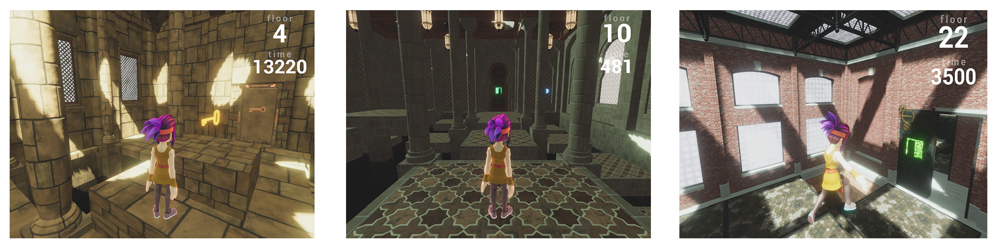

## Part 1 在GCP雲端平台進行訓練

### 進入GCP平台

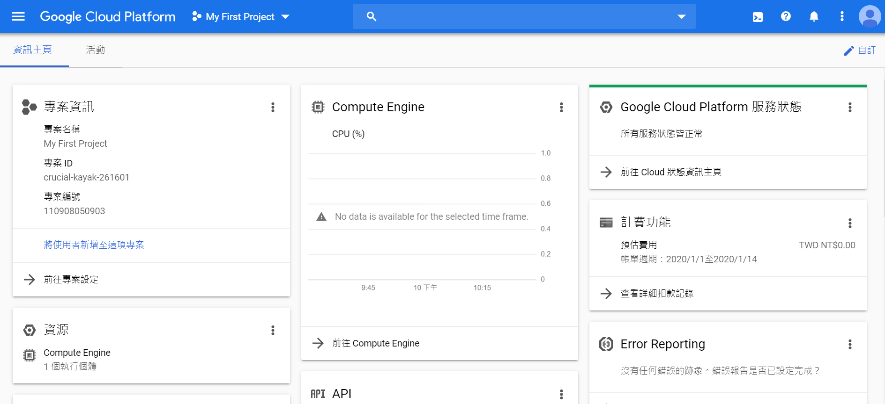
登入[GCP](https://cloud.google.com/gcp)，註冊或登入帳號，並且進入主控台。


### 申請GPU配額 (若已有申請過可跳過)

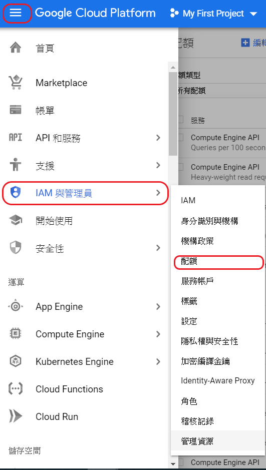

點選左上角導覽選單，選取「IAM與管理員」的「配額」。

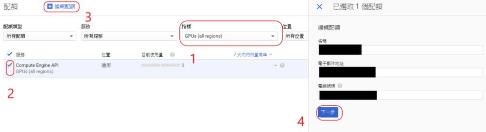
1. 指標選擇GPUs(all regions)
2. 將其打勾
3. 點選編輯配額
4. 輸入基本資料並且按下一步

新增的配額限制按照官方限制填5~10皆可，要求說明可以寫ML project就好，點選完成，提交要求。

## 創建VM


在左邊的側邊欄選取Marketplace，搜尋 "Deep Learning VM"，再點選 "在COMPUTE ENGINE上啟動"。


接下來要進行設定，基本上只需要更改Framework
1. 為了符合Tensorflow 1.12，選擇CUDA 9.0的版本（Intel(R) optimized Base (with Intel(R) MKL and CUDA 9.0)）
2. 勾選安裝NVIDIA GPU driver
3. 點選部署

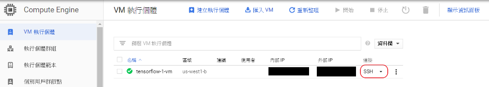
警告的話是有資源即將被棄用，不過現在運行是ok的。
接下來就是左邊側欄點選Compute Engine，VM 執行個體，然後點選SSH連接VM。

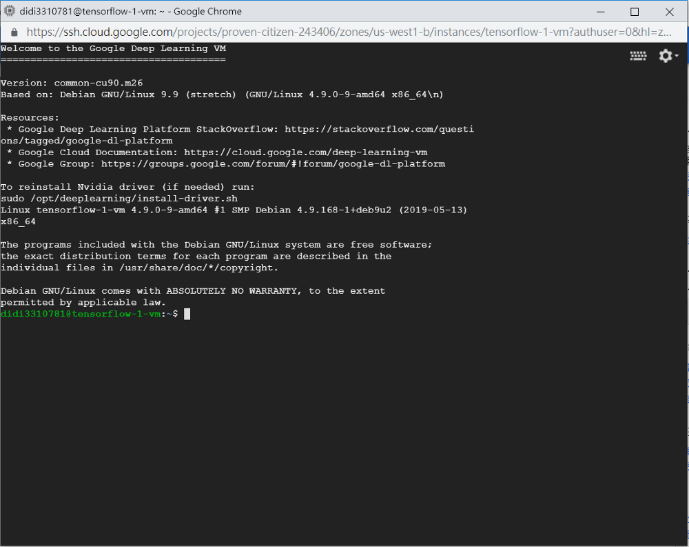
看到這就代表成功進入囉！

## 建立 XServer
要渲染 Obstacle Tower 環境，需要安裝XServer，以便在運行障礙塔時GPU可以渲染。
若已為VM配置好GPU，接著按照以下步驟安裝。

### 下載 Xorg 和 mesa-utils

```
sudo apt update
sudo apt install -y xserver-xorg mesa-utils
```

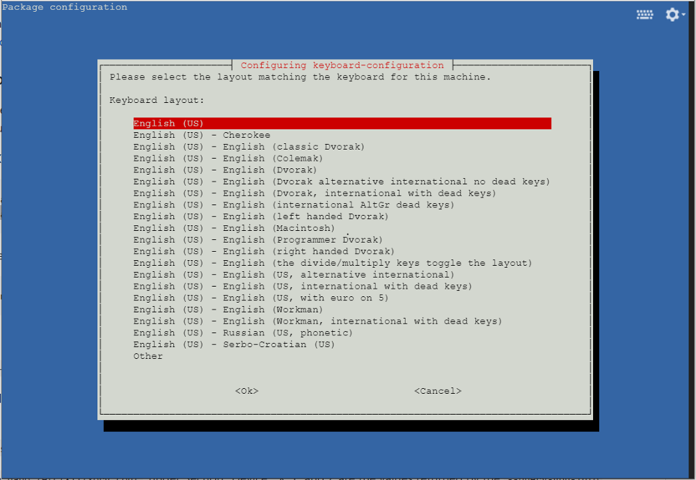

遇到這個情況時，直接按Enter即可。

初始化 "xorg.conf"
```
sudo nvidia-xconfig -a --use-display-device=None --virtual=1280x1024
```

跑

```
nvidia-xconfig --query-gpu-info
```

這將為特定的VM和GPU提供PCI訊息。找到讀取PCI BusID的那一行。

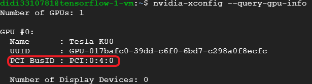


接下來要針對 xorg.conf 進行修改。

```
cd /etc/X11
```

由於修改需最大權限，所以這邊先執行

```
sudo su

```

第一個要修改的地方是新增BusID "X:Y:Z" ，他在 Section “Device”底下， X，Y和Z是上面的 — query-gpu-info命令返回的值。

```
vim xorg.conf
```

按 i 即可修改。

要將 Section Device 改成如下圖

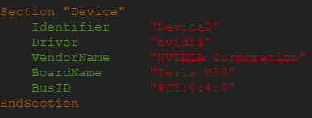

BusID裡面的數值按照 — query-gpu-info命令，如圖中的進行修改。

接著將 "ServerLayout" & "Screen" 這兩段地方註解掉，如下圖

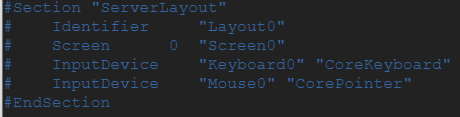
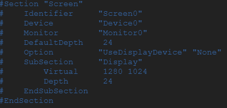

修改完後按 ESC，然後輸入":wq"儲存離開。


要啟動Xserver，需要運行以下兩個命令。請注意，如果重新啟動計算機，則需要再次運行這些程序，如果打開新的bash終端，則需要再次運行導出命令。

```
sudo /usr/bin/X :0 &
export DISPLAY=:0

```

接著跑

```
nvidia-smi
```

應該會看到Xorg正在你的GPU上運行。

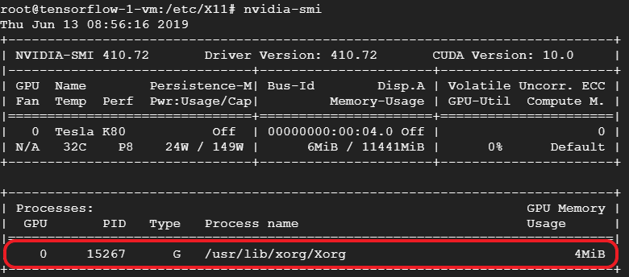
看到這個代表成功！

為確保一切正常運作，再執行命令glxgears，並確保它以成千上萬的幀速率運行 — 這代表我們使用GPU成功將OpenGL圖形渲染到虛擬螢幕上。
確認完有順利運行後，即可按 Ctrl + C 中斷執行。


## 安裝mini-conda

為控管運行環境，使用conda

```
wget https://repo.anaconda.com/miniconda/Miniconda3-latest-Linux-x86_64.sh
bash Miniconda3-latest-Linux-x86_64.sh
```

之後一直按enter，照著要求輸入yes後按下enter，接下來要注意，請慢慢按enter。
待再次詢問到輸入yes/no時，輸入yes後即可再一直按enter直到安裝完畢。

### 使用 mini-conda 模擬環境

安裝完程後，輸入以下指令來創建一個 python3.6 的環境

```
conda create --name otc-env python=3.6
```

輸入 conda env list 可列出當前的環境
確認有創建後，再執行底下指令

```
conda activate otc-env
```

若左邊出現(otc-env)就代表順利進到環境內囉！

### 安裝tensorflow

由於我們所選擇的VM只有CUDA 0.9，所以必須手動安裝tensorflow

```
pip3 install tensorflow-gpu==1.12
```

### 安裝 Obstacle Tower 環境

執行以下指令進行環境安裝

```
git clone https://github.com/Pianochicken/Final-Project-Obstacle-Tower.git
cd Final-Project-Obstacle-Tower
pip3 install ./ 
cd ../
```

接者下載、解壓縮主程式

```
wget https://storage.googleapis.com/obstacle-tower-build/v3.1/obstacletower_v3.1_linux.zip
unzip obstacletower_v3.1_linux.zip
```

## 安裝 Dopamine

首先安裝 Dopamine的所需套件

```
sudo apt update && sudo apt install cmake zlib1g-dev
pip3 install absl-py atari-py gin-config==0.1.4 gym opencv-python
```


### 下載Dopamine

```
git clone https://github.com/google/dopamine.git
```

為使dopmine能與Obstacle Tower環境相容，需下載底下檔案

```
wget https://storage.googleapis.com/obstacle-tower-build/dopamine/dopamine_otc.zip
unzip dopamine_otc.zip
```

在zip裡面有兩個檔案：unity_lib.py和rainbow_otc.gin
需將 unity_lib.py 以及 rainbow_otc.gin 放進相對應的資料夾內。

```
cp dopamine_otc/unity_lib.py dopamine/dopamine/discrete_domains/unity_lib.py
cp dopamine_otc/rainbow_otc.gin dopamine/dopamine/agents/rainbow/configs/rainbow_otc.gin
```

rainbow_otc.gin是訓練的設定檔，裡面有學習設定可以進行修改

```
create_otc_environment.environment_path: 遊戲路徑，須對應到主程式的路徑。
Runner.num_iterations: iteration次數。
Runner.training_steps: 每個iteration的訓練步數。
Runner.evaluation_steps: 經過多少步數後進行評估。
```

### 在後台背景進行訓練

由於訓練很可能需要非常多時間（可能超過24小時）！
因此在後台運行就會比較方便，可以在此期間斷開與VM的SSH連接，只要不要在訓練期間從GCP停止VM執行個體就好。 

```bash
screen -S dopamine_otc
```

這個指令會打開一個新的Bash shell。

此時需要在新shell中重新激活虛擬環境。

```bash
sudo /usr/bin/X :0 &
export DISPLAY=:0 
conda activate otc-env
```

接著即可在這裡準備使用Dopamine訓練囉。

### 使用Dopamine訓練
目前已經準備好使用Dopamine進行訓練了！

```
cd ./dopamine
```

進入到Dopamine Library的根目錄後，運行以下命令開始訓練：

```
python -um dopamine.discrete_domains.train \
 --base_dir=/tmp/dopamine \
 --gin_files='dopamine/agents/rainbow/configs/rainbow_otc.gin'
```

其中 base_dir 是保存其檢查點的目錄（可以將其更改為除了/tmp/dopamine以外的其他內容）和tensorboard文件
gin_files 則是 rainbow_otc.gin 的路徑。

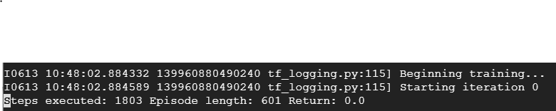

現在，開始訓練後，可以輸入 (Ctrl + A) 再輸入 (Ctrl +D) 來斷開和這個螢幕的連接，訓練會在後台繼續進行。
可輸入screen list來查看目前screen的狀況，只要再輸入 screen -r 即可重新連接回去。

每完成一段訓練後，就會在base_dir所設定的路徑產生許多checkpoint檔案

### 從 Tensorboard 監控訓練狀況
首先，若要監控訓練狀況，需再去編輯VM，於網路介面的外部IP中，建立IP位址。

設定完將 Port 開放後，即可在terminal上輸入已下指令來運行Tensorboard

```bash
tensorboard --logdir=/tmp/dopamine
```

--logdir: 這個路徑就是訓練時所設定的--base_dit

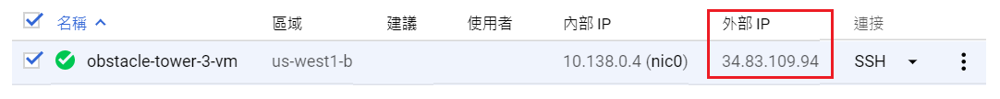

可從此處看到外部ip，在瀏覽器當中輸入 xx.xx.xx.xx:6006
就可看到Tensorboard的狀況囉！


## Part 2 本機端運行主程式：


### Requirements

The Obstacle Tower environment runs on Mac OS X, Windows, or Linux.

Python dependencies (also in [setup.py](https://github.com/Unity-Technologies/obstacle-tower-env/blob/master/setup.py)):

* Python 3.5 - 3.7
* Unity ML-Agents v0.10
* OpenAI Gym


### Install the Gym interface

```bash
git clone https://github.com/Pianochicken/Final-Project-Obstacle-Tower.git
cd Final-Project-Obstacle-Tower
pip3 install -e .
```

### 下載遊戲環境

| *Platform*     | *Download Link*                                                                     |
| --- | --- |
| Linux (x86_64) | https://storage.googleapis.com/obstacle-tower-build/v3.1/obstacletower_v3.1_linux.zip   |
| Mac OS X       | https://storage.googleapis.com/obstacle-tower-build/v3.1/obstacletower_v3.1_osx.zip     |
| Windows        | https://storage.googleapis.com/obstacle-tower-build/v3.1/obstacletower_v3.1_windows.zip |

選擇適合系統平台的檔案並下載，放在example資料夾內進行解壓縮。

## Getting Started

使用 Jupyter Notebook 開啟 [run.ipynb檔案](examples/run.ipynb)並執行。

在這個github裡面，我已將我之前所訓練出來的檔案放在 Obstacle Tower checkpoint 資料夾中，
但目前尚不知道該如何將這個訓練完的模型應用在本機端執行...


原始文件可參考：
https://github.com/Unity-Technologies/obstacle-tower-env
https://github.com/Unity-Technologies/obstacle-tower-env/blob/master/examples/gcp_training.md
