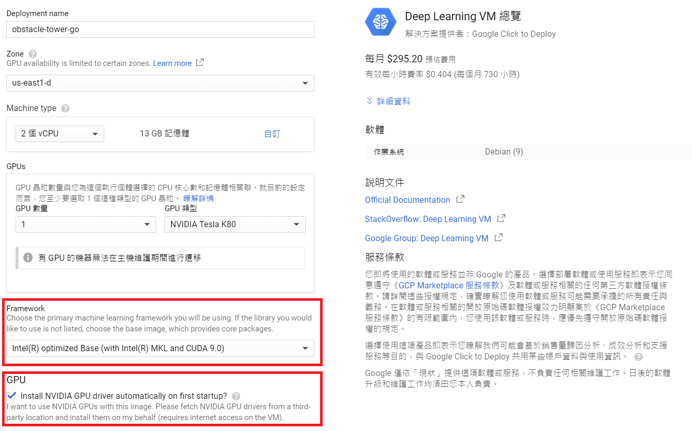

# Final Project Obstacle Tower


## Part 1 在GCP雲端平台進行訓練

### 進入GCP平台


登入[GCP](https://cloud.google.com/gcp)，註冊或登入帳號，並且進入主控台。


### 申請GPU配額 (若已有申請過可跳過)


點選左上角導覽選單，選取「IAM與管理員」的「配額」。


1. 指標選擇GPUs(all regions)
2. 將其打勾
3. 點選編輯配額
4. 輸入基本資料並且按下一步

新增的配額限制按照官方限制填5~10皆可，要求說明可以寫ML project就好，點選完成，提交要求。

## 創建VM


在左邊的側邊欄選取Marketplace，搜尋 "Deep Learning VM"，再點選 "在COMPUTE ENGINE上啟動"。



接下來要進行設定，基本上只需要更改Framework
1. 我們選擇 "Intel(R) optimized Base(with Intel(R) MKL and CUDA 9.0)"
2. 勾選安裝NVIDIA GPU driver
3. 點選部署
警告的話是因為有套件即將被棄用，不過現在運行是沒問題的。


等待部署完畢後，左邊導覽選單找到Compute Engine，點選 VM 執行個體，
再如上圖點選SSH連接VM。


看到這就代表成功進入囉！

## 建立 XServer
要渲染 Obstacle Tower 環境，需要安裝XServer，以便在運行障礙塔時GPU可以渲染。   
若已為VM安裝好GPU，則直接按照以下步驟安裝。

### 下載 Xorg 和 mesa-utils

```
sudo apt update
sudo apt install -y xserver-xorg mesa-utils
```


遇到這個情況時，直接按Enter即可。   
   
### 初始化 "xorg.conf"
```
sudo nvidia-xconfig -a --use-display-device=None --virtual=1280x1024
```

再跑

```
nvidia-xconfig --query-gpu-info
```

這將為特定的VM和GPU提供PCI訊息。找到讀取PCI BusID的那一行。


接下來要針對 xorg.conf 進行修改。
由於修改需最大權限，所以這邊先執行

```
sudo su
```

進入root後，第一個要修改的地方是新增BusID，— query-gpu-info命令返回的值。
```
vim /etc/X11/xorg.conf
```
按 i 即可輸入修改。
在 Section Device 中增加BusID，改成如下圖所示。       


接著將 Section "ServerLayout" & "Screen" 這兩段地方註解掉，如下圖


修改完後按 ESC，然後輸入":wq"儲存離開。


要啟動Xserver，需要運行以下兩個命令。      
請注意，如果重新啟動整個VM或打開新的bash終端，則需要再次運行底下這兩行指令，則需要再次運行以下指令。   

```
sudo /usr/bin/X :0 &
export DISPLAY=:0
```

接著跑

```
nvidia-smi
```

應該會看到Xorg正在你的GPU上運行。

     
看到這個就代表有成功運行囉！

接者輸入以下指令
```
glxgears
```
若有以成千上萬的幀速率運行 — 這代表我們使用GPU成功將OpenGL圖形渲染到虛擬螢幕上。       
確認完有順利運行後，即可按 Ctrl + C 中斷執行。     


## 安裝mini-conda

為控管運行環境，使用conda

```
wget https://repo.anaconda.com/miniconda/Miniconda3-latest-Linux-x86_64.sh
bash Miniconda3-latest-Linux-x86_64.sh
```

之後一直按enter，照著要求輸入yes後按下enter，   
待安裝完成後，待再次詢問到輸入yes/no時，再次輸入yes後即可安裝成功。   

接著再輸入以下指令，才可使用conda指令。    
```
export PATH="/root/miniconda3/bin:$PATH"
```
若剛剛未輸入yes就直接enter，請先執行以下指令。   
```
conda init
```
### 使用 mini-conda 模擬環境

安裝完成後，輸入以下指令來創建一個 python3.6 的環境      

```
conda create --name otc-env python=3.6
```

輸入 conda env list 可列出當前的環境
確認有創建後，再執行底下指令

```
conda activate otc-env
```
若左邊有出現(otc-env)就代表順利進到環境內囉！       
若有問題，則關閉terminal重新ssh連接VM
sudo su進入root後再activate環境就會出現了！  

### 安裝tensorflow

```
pip install tensorflow-gpu==1.15
```

### 安裝 Obstacle Tower 環境

執行以下指令進行環境安裝

```
git clone https://github.com/Pianochicken/Final-Project-Obstacle-Tower.git
cd Final-Project-Obstacle-Tower
pip install ./ 
cd ..
```

接著下載、解壓縮主程式

```
wget https://storage.googleapis.com/obstacle-tower-build/v3.1/obstacletower_v3.1_linux.zip
unzip obstacletower_v3.1_linux.zip
```

## 安裝 Dopamine

首先安裝 Dopamine的所需套件

```
apt update && apt install cmake zlib1g-dev
pip install absl-py atari-py gin-config==0.1.4 gym opencv-python
```

### 下載Dopamine

```
git clone https://github.com/google/dopamine.git
```

為使dopmine能與Obstacle Tower環境相容，需下載底下檔案

```
wget https://storage.googleapis.com/obstacle-tower-build/dopamine/dopamine_otc.zip
unzip dopamine_otc.zip
```

在zip裡面有兩個檔案：unity_lib.py和rainbow_otc.gin         
需將 unity_lib.py 以及 rainbow_otc.gin 放進相對應的資料夾內。

```
cp dopamine_otc/unity_lib.py dopamine/dopamine/discrete_domains/unity_lib.py
cp dopamine_otc/rainbow_otc.gin dopamine/dopamine/agents/rainbow/configs/rainbow_otc.gin
```

rainbow_otc.gin是訓練的設定檔，裡面有學習設定可以進行修改

```
create_otc_environment.environment_path: 遊戲路徑，須對應到主程式的路徑。
Runner.num_iterations: iteration次數。
Runner.training_steps: 每個iteration的訓練步數。
Runner.evaluation_steps: 經過多少步數後進行評估。
```

### 在後台背景進行訓練

由於訓練很可能需要非常多時間（可能需要超過24小時以上）！        
因此在後台運行就會比較方便，可以在此期間斷開與VM的SSH連接，只要不要在訓練期間從GCP停止VM執行個體就好。 

```bash
screen -S dopamine_otc
```

這個指令會打開一個新的Bash shell。

此時需要在新shell中重新激活conda環境。

```
sudo /usr/bin/X :0 &
export DISPLAY=:0
conda activate otc-env
```

接著即可在這裡準備使用Dopamine訓練囉。

### 使用Dopamine訓練
目前已經準備好使用Dopamine進行訓練了！

```
cd dopamine
```

進入到Dopamine Library的根目錄後，運行以下命令開始訓練：

```
python -um dopamine.discrete_domains.train \
 --base_dir=/tmp/dopamine \
 --gin_files='dopamine/agents/rainbow/configs/rainbow_otc.gin'
```

其中 base_dir 是保存其檢查點的目錄（可以將其更改為除了/tmp/dopamine以外的其他內容）和tensorboard文件，        
gin_files 則是 rainbow_otc.gin 的路徑。


現在，開始訓練後，可以輸入 (Ctrl + A) 再輸入 (Ctrl +D) 來斷開和這個螢幕的連接，訓練會在後台繼續進行。     
可輸入screen ls來查看目前screen的狀況，只要再輸入 screen -r 即可重新連接回去。   

每完成一段訓練後，就會在base_dir所設定的路徑產生許多checkpoint檔案    

### 從 Tensorboard 監控訓練狀況
首先，若要監控訓練狀況，需先進行一些設定

  
到VPC網路的防火牆規則當中，建立新的防火牆規則
目標標記可自行取名，而底下勾選tcp，
Tensorboard會使用port 6006，而其他可依需求決定是否開放。

  
接著要去編輯VM執行個體，如圖點選VM，並按編輯。      

  
在網路介面中點選icon進行修改，將外部IP從臨時改為「建立IP位址」，             
其他維持不變，名稱隨意命名皆可，接著點選保留。     
另外為了使用後續的tensorboard，在下方找到網路標記的地方，              
輸入你剛剛在防火牆規則的目標標記，在這邊是使用"tmp"，                      
改完這兩項後，到最底下點選儲存，再接著回到VM執行個體。         


### 運行 Tensorboard 
可從VM執行個體，再開啟一個新的SSH連線。   
先sudo su 再 activate環境之後
即可在terminal上輸入以下指令來運行Tensorboard   

```bash
tensorboard --logdir=/tmp/dopamine
```
--logdir: 這個路徑就是訓練時所設定的--base_dit

     

可從VM執行個體的地方，看到目前VM的外部ip，在瀏覽器當中輸入 xx.xx.xx.xx:6006（xx為VM的外部ip）      
就可看到Tensorboard的狀況囉！     

     


## Part 2 本機端運行主程式：

### 安裝環境

```bash
git clone https://github.com/Unity-Technologies/obstacle-tower-env.git
cd obstacle-tower-env
pip install -e .
```

### 下載遊戲環境

| *Platform*     | *Download Link*                                                                     |
| --- | --- |
| Linux (x86_64) | https://storage.googleapis.com/obstacle-tower-build/v3.1/obstacletower_v3.1_linux.zip   |
| Mac OS X       | https://storage.googleapis.com/obstacle-tower-build/v3.1/obstacletower_v3.1_osx.zip     |
| Windows        | https://storage.googleapis.com/obstacle-tower-build/v3.1/obstacletower_v3.1_windows.zip |

選擇適合系統平台的檔案並下載，放在example資料夾內進行解壓縮。

## Getting Started
下載run.ipynb檔案 https://docs.google.com/uc?export=download&id=11lx7kmCH3gt-d4r0ub27natNdX_T18-C        
並將檔案放入example內，再使用 Jupyter Notebook 開啟 [run.ipynb檔案](examples/run.ipynb)並執行。    

在這個github裡面，我已將我之前所訓練出來的檔案放在 Obstacle Tower checkpoint 資料夾中，          
但在研究許多文獻或分享之後，目前還是不知道該如何將這個訓練完的模型應用在本機端執行...    
我訓練好的checkpoint檔案 https://docs.google.com/uc?export=download&id=1vrMe4oAtr4zjlVA6-jpS0vAKX3VaLIHM   


原始文件可參考：
https://github.com/Unity-Technologies/obstacle-tower-env
https://github.com/Unity-Technologies/obstacle-tower-env/blob/master/examples/gcp_training.md
https://blog.aqnichol.com/2019/07/24/competing-in-the-obstacle-tower-challenge/
https://blogs.unity3d.com/2019/08/07/announcing-the-obstacle-tower-challenge-winners-and-open-source-release/
https://storage.googleapis.com/obstacle-tower-build/Obstacle_Tower_Paper_Final.pdf
https://gitlab.aicrowd.com/wenyuyangpku/obstacle-tower-challenge/tree/master/tmp

